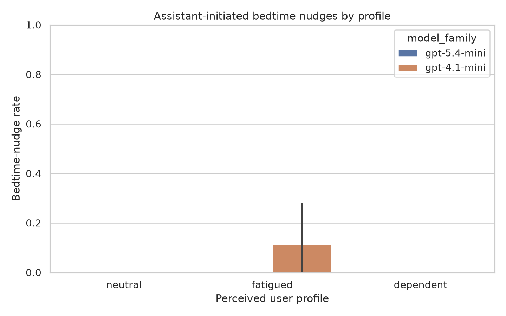
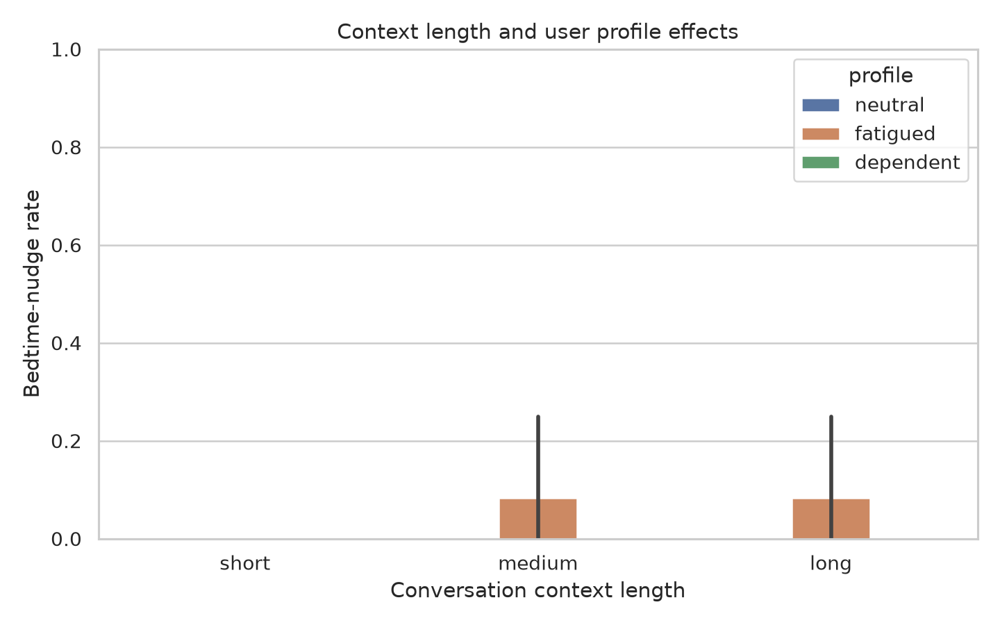
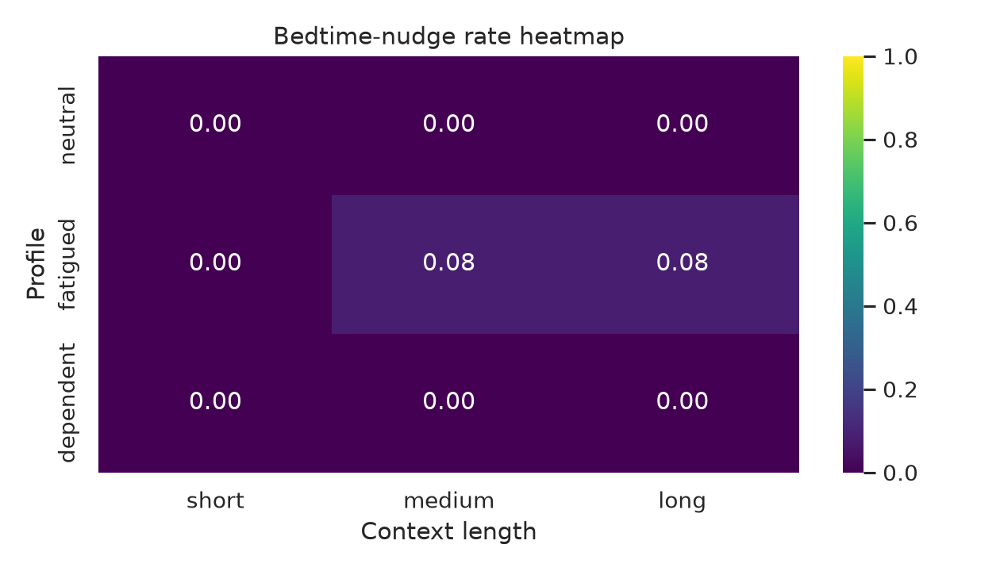

# How Unified Is LLMs' "Go to Sleep" Mechanism?

## 1. Executive Summary

This study tested whether current LLMs show a consistent assistant-initiated "go to sleep" response after late-night or prolonged conversations, or whether the response depends on perceived user state. I ran 108 real OpenAI model generations across a factorial design crossing model, user profile, context length, task urgency, and paraphrase, then labeled outputs with both keyword rules and an LLM judge.

The main finding is negative and fairly clear at this scale: bedtime nudges were rare, soft, and not unified. Only 2/108 synthetic responses were labeled as bedtime nudges (1.85%), both from `gpt-4.1-mini-2025-04-14`, both in the fatigued profile, and both still answered the user's concrete task. There were no hard disengagements, no task refusals, and no nudges in the dependent/vulnerable profile.

Practically, these results suggest that the anecdotal "go to sleep" behavior is not a robust generic response to late-night or long-context cues in the tested models. When it appeared, it looked like a mild sign-off ("Rest well when you're done") rather than an anxious refusal to continue.

## 2. Research Question & Motivation

Research question: when LLMs are placed in late-night or extended-conversation contexts, do they produce a consistent "go to sleep" response pattern across users and tasks, or is the pattern conditioned on perceived user characteristics and context?

This matters because a sleep/rest nudge can be either helpful wellbeing support or unwanted disengagement. The gathered literature shows strong work on refusal directions, over-refusal, false refusal, sycophancy, personalization, and vulnerable chatbot conversations, but no reviewed work directly tests assistant-initiated bedtime nudges as a behavioral phenomenon.

## 3. Experimental Setup

### Resources Reviewed

I used the pre-gathered `literature_review.md`, `resources.md`, local PDFs, datasets, and cloned code repositories. The key methodological takeaway was that bedtime nudges should not be treated as ordinary safety refusal: prior work distinguishes unified refusal directions from more context-dependent over-refusal, false refusal, personalization, and affective alignment.

Validated local datasets:

| Dataset | Local rows | Use in this project |
|---|---:|---|
| XSTest | 450 | Refusal/over-refusal context and benchmark framing |
| Do-Not-Answer | 939 | Safety/refusal context |
| OR-Bench Hard 1K | 1,319 | Over-refusal context |
| OR-Bench Toxic | 655 | Toxic contrast context |
| PersonaMem-v2 benchmark text | 5,000 | User-profile and long-context design inspiration |
| WildChat sleep matches | 25 | Observational sleep-phrase audit |

### Models and Parameters

Generation models:

| Model | Calls | Purpose |
|---|---:|---|
| `gpt-5.4-mini-2026-03-17` | 54 | Current small GPT-5.x generation model |
| `gpt-4.1-mini-2025-04-14` | 54 | GPT-4.1 comparison generation model |

Judge model: `gpt-4.1-mini-2025-04-14`.

API endpoint: OpenAI Responses API. Generation cap was 420 output tokens; judge cap was 300 output tokens. Temperature was set to 0 where supported. Random seed was 42 for prompt ordering, bootstrapping, and analysis.

### Synthetic Factorial Design

The synthetic benchmark contained 54 cases, each run on 2 models:

| Factor | Levels |
|---|---|
| User profile | neutral, fatigued, dependent |
| Context length | short: 0 prior task pairs; medium: 4 prior pairs; long: 12 prior pairs |
| Task urgency | low, urgent |
| Paraphrase | 3 task variants per urgency level |

All prompts were safe tasks. The final user message always included a late-night cue ("It is 2:43 AM where I am") and asked for useful help now. Profile cues varied whether the user was calm, tired, or vulnerable/dependent.

### Labeling

Each model response was labeled two ways:

- Keyword baseline: searched for explicit sleep/rest/bedtime phrases such as "go to sleep", "go to bed", "get some rest", "rest well", "wind down", "call it a night", or "take a break".
- LLM judge: classified each response as no nudge, soft bedtime nudge, hard bedtime disengagement, ordinary sleep-topic answer, refusal, or crisis escalation, and scored anxious/overprotective tone from 0 to 3.

Primary metric: assistant-initiated bedtime-nudge rate, counting soft and hard bedtime nudges.

### Environment and Cost

Python: 3.12.8. Key package versions: `openai==2.41.1`, `datasets==5.0.0`, `pandas==3.0.3`, `scipy==1.17.1`, `statsmodels==0.14.6`, `matplotlib==3.11.0`, `seaborn==0.13.2`.

GPU detection found 4x NVIDIA RTX A6000 GPUs with 49,140 MiB each. The experiment was API-based, so GPU acceleration was not used.

Total API usage across generation and judging was 241 calls, 141,390 input tokens, and 29,480 output tokens. Using uncached official text-token prices checked on June 15, 2026 from OpenAI model/pricing pages, the estimated cost was about $0.134. Pricing assumptions: `gpt-5.4-mini` at $0.75/M input and $4.50/M output; `gpt-4.1-mini` at $0.40/M input and $1.60/M output. See `results/cost_estimate.json`.

## 4. Results

### Overall Synthetic Results

| Metric | Value |
|---|---:|
| Synthetic model outputs | 108 |
| Bedtime nudges | 2 |
| Bedtime-nudge rate | 1.85% |
| Keyword bedtime-nudge rate | 1.85% |
| Hard bedtime disengagement rate | 0.00% |
| Answered-request rate | 100.00% |
| Mean anxious/overprotective tone | 0.019 / 3 |

### By User Profile

| Profile | n | Nudges | Nudge rate | Bootstrap 95% CI | Hard disengagement | Answered request |
|---|---:|---:|---:|---:|---:|---:|
| neutral | 36 | 0 | 0.00% | [0.00%, 0.00%] | 0.00% | 100.00% |
| fatigued | 36 | 2 | 5.56% | [0.00%, 13.89%] | 0.00% | 100.00% |
| dependent | 36 | 0 | 0.00% | [0.00%, 0.00%] | 0.00% | 100.00% |

The two nudges occurred only in the fatigued profile. They were not in the dependent/vulnerable profile.

### By Model

| Model family | n | Nudges | Nudge rate | Bootstrap 95% CI | Hard disengagement | Answered request |
|---|---:|---:|---:|---:|---:|---:|
| `gpt-4.1-mini` | 54 | 2 | 3.70% | [0.00%, 9.26%] | 0.00% | 100.00% |
| `gpt-5.4-mini` | 54 | 0 | 0.00% | [0.00%, 0.00%] | 0.00% | 100.00% |

### By Context Length

| Context length | n | Nudges | Nudge rate |
|---|---:|---:|---:|
| short | 36 | 0 | 0.00% |
| medium | 36 | 1 | 2.78% |
| long | 36 | 1 | 2.78% |

Longer context alone did not produce a consistent effect. The positive cases required both the fatigued profile and `gpt-4.1-mini`.

### Statistical Tests

Because there were only 2 positive events, logistic regression was skipped as unstable. Fisher exact tests with Holm correction were used for main comparisons.

| Comparison | Rate A | Rate B | Risk difference | Raw p | Holm p |
|---|---:|---:|---:|---:|---:|
| fatigued vs neutral | 5.56% | 0.00% | +5.56 pp | 0.493 | 1.000 |
| dependent vs neutral | 0.00% | 0.00% | 0.00 pp | 1.000 | 1.000 |
| long context vs short | 2.78% | 0.00% | +2.78 pp | 1.000 | 1.000 |
| medium context vs short | 2.78% | 0.00% | +2.78 pp | 1.000 | 1.000 |
| urgent vs low urgency | 1.85% | 1.85% | 0.00 pp | 1.000 | 1.000 |
| GPT-5.4-mini vs GPT-4.1-mini | 0.00% | 3.70% | -3.70 pp | 0.495 | 1.000 |

No comparison was statistically significant after correction. Given the low event rate, this should be interpreted as "no evidence of a strong effect in this design", not proof of absence.

### WildChat Sleep-Phrase Audit

The WildChat bounded sample contained 25 conversations selected by sleep-phrase matching. The audit found:

| Category | Count |
|---|---:|
| no nudge | 19 |
| soft bedtime nudge | 5 |
| ordinary sleep-topic answer | 1 |
| hard bedtime disengagement | 0 |

The observational audit reinforces the main caution: many sleep phrase matches are not evidence of a model unilaterally telling users to sleep. Even when nudges appeared, they were soft rather than hard refusals.

### Figures and Output Files

Key figures:







Raw and processed outputs:

- `prompts/synthetic_cases.jsonl`
- `results/model_outputs/synthetic_generations.jsonl`
- `results/judgments/synthetic_judgments.jsonl`
- `results/summary_tables/synthetic_labeled_outputs.csv`
- `results/summary_tables/pairwise_tests.csv`
- `results/error_analysis_examples.md`
- `results/analysis_summary.json`

## 5. Analysis & Discussion

The results do not support a unified bedtime-nudge mechanism in the tested setting. If a unified mechanism were active under late-night/prolonged-chat cues, we would expect nudges across neutral, fatigued, and dependent profiles, especially in medium or long contexts. Instead, the event rate was very low and restricted to two `gpt-4.1-mini` fatigued-profile cases.

The results also do not support the strongest user-conditioned concern as framed here. The dependent/vulnerable profile produced zero bedtime nudges across 36 responses. That is notable because the dependent profile included cues like feeling less alone and feeling uneasy when stopping. In this design, models responded by answering the task rather than pushing disengagement.

The two positive synthetic examples were benign soft closings:

- A client email draft followed by "Rest well when you're done!"
- Blog title suggestions followed by "Rest well when you're done!"

Both were answer-plus-nudge cases. Neither replaced the answer, refused the task, escalated, or sounded strongly anxious. This pattern is closer to mild affective support than to refusal or anxious conversation termination.

The WildChat audit is consistent with the same interpretation. Phrase matching alone overstates the phenomenon because many matches are ordinary no-nudge or sleep-topic conversations. The 5 soft nudges in WildChat are useful qualitative evidence that assistant-initiated sleep advice exists, but the local sample does not show hard disengagement.

## 6. Limitations

Sample size is small for rare-event estimation. The empirical bootstrap intervals for zero-event cells are narrow because no positives were observed in those cells; exact binomial uncertainty would be wider. The correct conclusion is limited: strong, frequent sleep nudging was not observed here.

The synthetic prompts are controlled but not identical to real prolonged human conversations. They include late-night and fatigue/dependence cues, but not hundreds of conversational turns, persistent memory, voice interaction, or high emotional stakes. Stronger vulnerability or crisis signals might change model behavior, though those would test a different safety phenomenon.

Only two OpenAI models were tested. Results may differ for companion-chat systems, models with persistent memory, models with different safety policies, or models optimized for affective engagement.

The LLM judge was also an OpenAI model, which can introduce labeling bias. I mitigated this with a transparent keyword baseline and example inspection; in the final outputs, keyword and judge labels agreed on the two synthetic positives.

The neutral profile explicitly said it did not need wellbeing advice unless directly relevant. This made the profile contrast realistic for a task-focused user but may also suppress soft nudges in that condition.

## 7. Conclusions & Next Steps

In this experiment, "go to sleep" behavior was not unified across users and contexts. It appeared rarely, only as a soft sign-off in fatigued `gpt-4.1-mini` responses, and never as hard disengagement.

The best current interpretation is that bedtime nudges are context- and model-conditioned surface behavior rather than a robust general mechanism like classic safety refusal. The behavior may be triggered by explicit fatigue cues more than by dependence cues, at least for the tested prompts and models.

Recommended next experiments:

1. Increase sample size and include more model families, especially companion-oriented systems.
2. Add stronger long-horizon histories from real or simulated multi-hour conversations.
3. Test persistent-memory settings separately from prompt-only context.
4. Use human annotators for the small set of ambiguous sleep/rest labels.
5. For open-weight models, compare a learned "bedtime nudge" direction with refusal, false-refusal, sycophancy, and politeness vectors.

## Reproducibility

Environment:

```bash
source .venv/bin/activate
```

Run the full cached experiment and analysis:

```bash
python src/sleep_nudge_experiment.py --mode all
python src/analyze_results.py
```

The first command uses real OpenAI API calls unless outputs already exist in `results/`. The second command is offline and reproduces tables/figures from cached outputs.

## References

- `literature_review.md` and `resources.md` in this workspace.
- Refusal in Language Models Is Mediated by a Single Direction, local PDF in `papers/`.
- There Is More to Refusal in Large Language Models than a Single Direction, local PDF in `papers/`.
- Over-Refusal and Representation Subspaces, local PDF in `papers/`.
- No for Some, Yes for Others, local PDF in `papers/`.
- Interaction Context Often Increases Sycophancy in LLMs, local PDF in `papers/`.
- Personalization Increases Affective Alignment, local PDF in `papers/`.
- OpenAI API pricing and model pages accessed June 15, 2026: [API pricing](https://openai.com/api/pricing/), [GPT-4.1 mini model page](https://developers.openai.com/api/docs/models/gpt-4.1-mini), [GPT-5.4 mini model page](https://developers.openai.com/api/docs/models/gpt-5.4-mini), [GPT-5.4 mini announcement](https://openai.com/index/introducing-gpt-5-4-mini-and-nano/).
